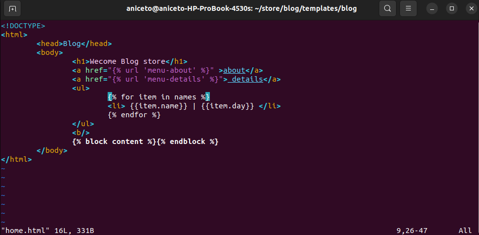

<div style="text-align: center;" markdown="1">

# Creating application with `django` using `vim`
#

</div>

#### Check if [Python](https://www.python.org/downloads/), [Anaconda](https://www.anaconda.com/download) and [Django](https://www.djangoproject.com/download/) Is Installed on Ubuntu

>>>> if you want download to see all files [store.zip](store.zip)

### Let's create a new `app`.
#
- Step 1
```shell
django-admin startapp blog
```

- Step 2 (blog)
### blog

- - ```shell 
    mkdir templates
    ```
- - ```shell
    mkdir blog
    ```
- - ```shell
    vim home.html
    ```
- - ```shell
    vim about.html
    ```
- - ```shell
    vim details.html
    ``` 

> [!NOTE]
> **mkdir** ⇢ Command to create dir.
> 
> **vim file_name** ⇢ Command to create or edit new file.
> 





- Step 3 (store)
### store


- Step 4 (run app)
### Run app


#
