<div style="text-align: center;" markdown="1">

# Installing the `django` correctly
#


</div>

#### Check if Python Is Installed on Ubuntu
```shell
python3
```

> [!IMPORTANT]
> If you have not installed the python on your machine, run this command below:

~~~shell
sudo apt install python3
~~~
~~~shell
python3 --version
~~~
```shell
sudo apt update
```

> [!CAUTION]
> Avoids installing Django in the global virtual environment of the operational system. Create your own virtual environment to avoid conflict with __root__.

### Let's create a new environment variable.
#
- Step 1
```shell
python3 -m venv ~/web_env
```
> [!NOTE]
> **python3 -m venv** ⇢ Command to create the virtual environment.
> 
> > **~/** ⇢ Virtual environment path.
> 
> **web_env** ⇢ Virtual environment Name.
> 

- Step 2

> [!WARNING]
> The path is where the new environment will be saved on your computer.
> 
>The final step in setting up your virtual environment is to activate it:

```shell
source ~/web_env/bin/activate
```

- Step 3

> [!TIP]
> After you’ve created and activated a virtual environment, enter the command:

```shell
pip install django
```

- Step 4

```shell
python -m django --version
```

- Step 5

```shell
django-admin
```
> List all commands of Django.
> 
> 

### Let's create a new project

1)
```shell
django-admin startproject web
```

> [!NOTE]
> **django-admin startproject** ⇢ Command to create the project
> 
> **web** ⇢ Project Name
> 
> This command created a new project.
> 
2)
> Enter the project folder.
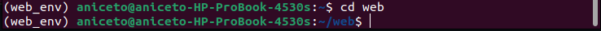

3)

> [!IMPORTANT]
> Opens the `settings.py` file and comments on the `DATABASES`

<details>
    <summary> File location </summary>
    a) 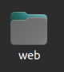
    b) 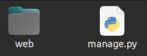
    c) 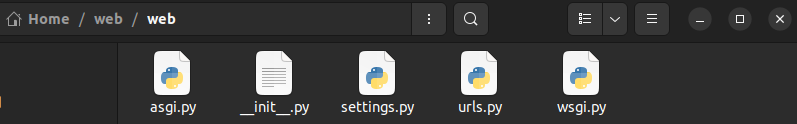
    d) 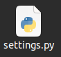
    e) 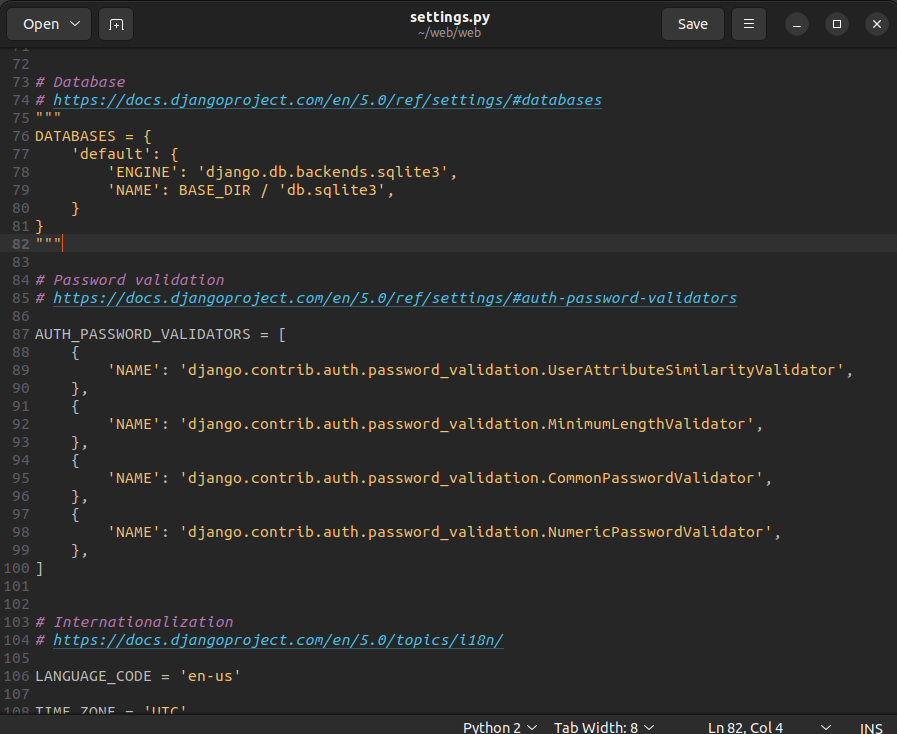
</details>

> [!CAUTION]
> Before
> 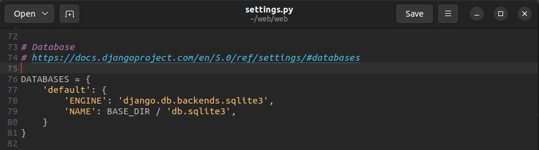

> [!TIP]
> After
> 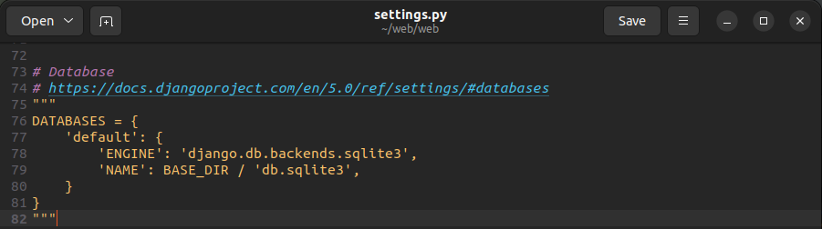


 Now run the `manage.py` file
```shell
python manage.py runserver
```
 > [!NOTE]
 > You are to be congratulated now you have your first Django project installed.
 
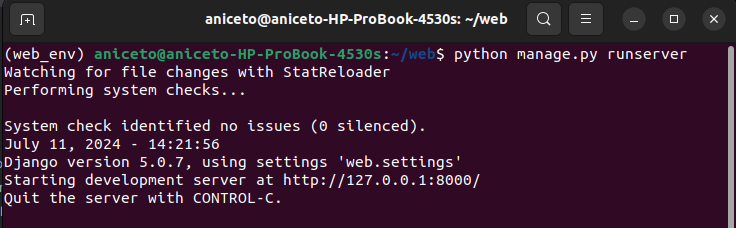
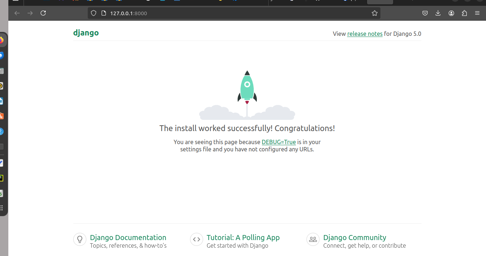
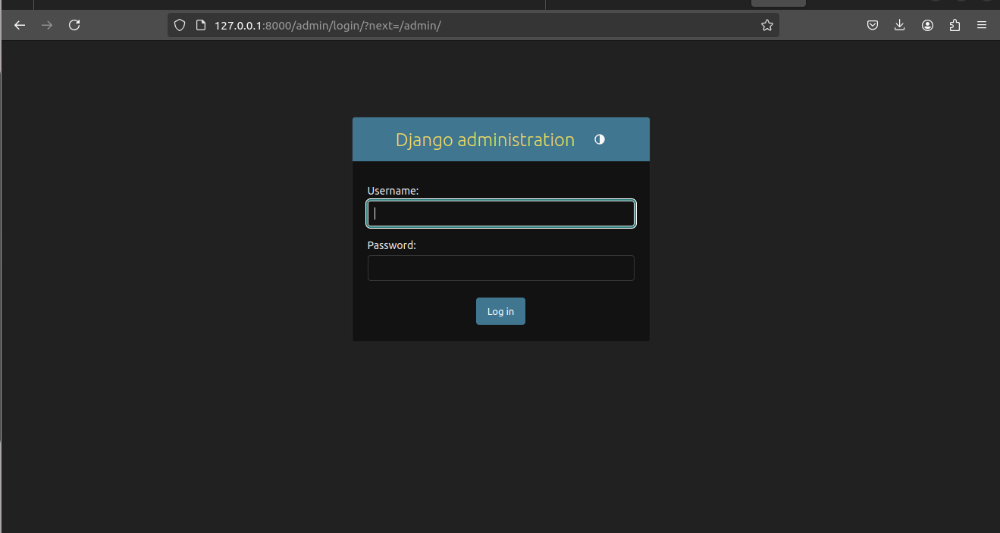

#
